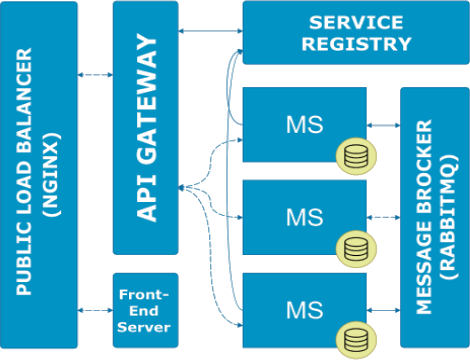
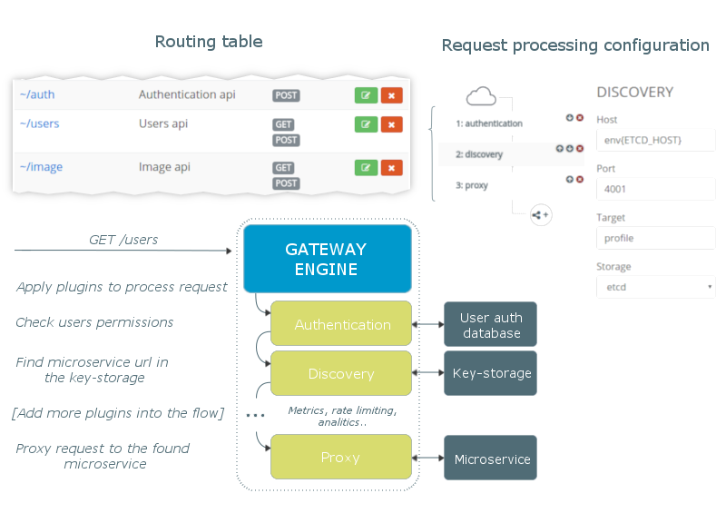
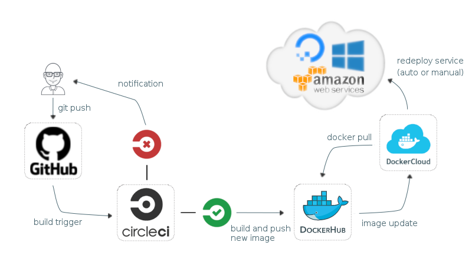

[DEMO](http://aksenchyk.com/)


> ## Solution is under development

This is a proof-of-concept application, which demonstrates Microservice Architecture Pattern using Javascript stack and Docker.

# Documentation

## Table of Contents

- [Introduction](#introduction)
- [Before You Start](#before-you-start)
- [Overview](#overview)
  - [Stack](#stack)
  - [Project Structure](#project-structure) 
- [Api Gateway and Request Flow](#api-gateway-and-request-flow) 
- [Service registry](#service-registry)
- [Messaging](#messaging)
- [Security](#security)
- [Continuous Delivery](#continuous-delivery) 
- [Testing](#testing)
- [Development](#development)
- [Web Client](#web-client)

## Introduction

Monolithic structure is easy to understand and develop. It may become a different story when we 
try to implement more and more features and keep our app coherent. Comparing to monolith, 
microservices architecture [has many benefits](http://eugenedvorkin.com/seven-micro-services-architecture-advantages/). 
Because of Docker's fast growing it becomes easier and more practical to apply microservises 
architecture to this widely adopted container virtualization technology. Microservices architecture 
also has disadvantages, such as increasing complexity of development workflow, deployment and management, 
operational overhead. One have to write the entire application involving all development stages 
to understand the requirements of the new architecture. That is why this project exists. 
To estimate different approaches, and find optimal stack of tecnologies. That is why this solution 
is very opinionated, because what fits to me, may not fit to you. So, if you are interested...

## Before You Start:
- Install [docker](https://docs.docker.com/engine/installation/) and [docker-compose](https://docs.docker.com/compose/install/) in your system.

## Overview
### Stack
#### Technologies Being Used in This Project:
 - [Loopback Node.js Framework](https://loopback.io/) - awesome solution for creating dynamic REST APIs without efforts.
 - [RabbitMQ](http://www.rabbitmq.com/) - as messaging platform for inter-service communication.
 - [Etcd2](https://github.com/coreos/etcd/blob/master/Documentation/v2/README.md) as key-storage for service discovery metadata.
 - [Angular2](https://github.com/angular/angular) as front-end framework.
 - MongoDB as microservices persistance

#### Covered Design Patterns:
 - [Service Discovery](http://microservices.io/patterns/server-side-discovery.html)
 - [Api Gateway](http://microservices.io/patterns/apigateway.html)
 - [Service registry](http://microservices.io/patterns/service-registry.html)
 - [Asynchronous Event Bus](http://microservices.io/patterns/data/event-driven-architecture.html)

### Project Structure

 - Logical group: 
   - [Fm-200loc](https://github.com/byavv/fm-200loc) - plugin-based api gateway
   - Etcd2 
   - RabbitMQ
 - Microservices:
   - [Fm-cars](https://github.com/byavv/fm-cars) 
   - [Fm-tracker](https://github.com/byavv/fm-tracker)
   - [Fm-profile](https://github.com/byavv/fm-profile)
   - [Fm-image](https://github.com/byavv/fm-image)
 - [Web client application](https://github.com/byavv/fm-web)

#### The Conceptual Model:
<p align="center">
  
</p>

**[Back to top](#table-of-contents)**

## API Gateway and Request Flow

There are four core services, exposing external API to clients in this project. 
In real-world systems, this number can grow quickly as well as system complexity as a whole. 
Actually, dozens of services might be involved in processing request or rendering a complex webpage.
We need some kind of routing. In theory, a client application could not use routing at all and call 
microservices directly, but, there are serious drawbacks and limitations 
of the design like this. Firstly - security. You must protect all microservices which are required 
by client and publically accessable. It is doable, if you have a couple of them, but if dozens - it can 
make more problems that it solve. Also, client need to know all endpoints addresses, 
perform http request for each peace of information separately, merging the result on a client side.
Much better approach is to use API Gateway. It is a single entry point into the system, 
used to handle requests by routing them to the appropriate backend service. 

Api gateway of this project is uses simple functional blocks (plugins) to process request using 
dynamic routing table. Request flow and its real management in gateway's dashboard:

<div align="center">
  
</div>

There are three plugins in our case:
 - **Authentication** uses Loopback's authentication api in part of extracting user metadata from request and 
checking permissions. Permission checking [implements](https://en.wikipedia.org/wiki/Role-based_access_control) 
[RBAC](https://blog.nodeswat.com/implement-access-control-in-node-js-8567e7b484d1#0685) model.
 - **Discovery**. Requests key-storage for [registered](#service-registry) microservice metadata (etcd2 in our case).
 - **Proxy**. Using popular [node-http-proxy](https://github.com/nodejitsu/node-http-proxy) proxies request to the microservice 
 instance based on found metadata.

Plugins are like simple express middleware with only one difference. 
They are assigned to a route according to the dynamic routing table. And you can manage their 
settings in the gateway dashboard. So, as you can see, gateway in reality just a plugin-starter and a tool to build routing 
table for the API, provided by number of microservices. Plugins, in their turn borrow main 
responsibility for gateway's functionality.

>The gateway [fm-200loc](https://github.com/byavv/fm-200loc) project was build as part of this POC and is **not** production ready. It've never been used in 
production and has a lot of disadvantages. If I see community's interest in this project, I'll consider its maintenance.

**[Back to top](#table-of-contents)**
 
## Service Registry
This project contains highly availabable **etcd2** cluster wich is used as key-storage to keep up discovery metadata 
to be exploited by the gateway (its discovery plugin) to find real microservice location in a virtual 
network. How the storage gets this microservice metadata? When microservice starts it registers itself in the storage sending
metadata and maintains it by means of 'heartbeat' request. If microservice goes down, **etcd** automatically
removes it from registry. In addition **etcd** automatically balances microservices if you have more then 
one instance of it. This feature makes scaling of this architecture very straightforward. Just run more instances 
of necessary microservice if you need. This is actual only if you run this infrastructure out of Docker Swarm. When Docker 1.1.12 
released and it stared to support clustering, providing services discovery you only need to set microservice name (```cars``` for example) as target of your microservice 
like this: ```http://cars:3044```  when configuring your api gateway entry and Docker Swarm will do the rest. 
(this solution uses [Docker Cloud](https://cloud.docker.com) to manage services, which is Swarm in it's core).


**[Back to top](#table-of-contents)**

## Messaging
Next problem we need to solve is how microservices communicate to each other to process complex request.
There are a lot of cases where we need both async and sync operations. For instance, we need confirmation on client side 
that all client's images uploaded into Amazon S3. There are two microservices involved into this process: [fm-cars](https://github.com/byavv/fm-cars), which holds all
newly created or updated car's fields and [fm-image](https://github.com/byavv/fm-image) which process upload. 
In more complex solutions there can be dozens of microservices handling one request. The best option here ([opinionated](#introduction)) is implementing 
[Service Bus pattern](http://microservices.io/patterns/data/event-driven-architecture.html) via RabbitMQ with ability to perform [RPC](https://www.rabbitmq.com/tutorials/tutorial-six-python.html) operations. 
It makes solution much more complex, but there are reasons why you should pay the price. Let imagine state of 
your system when one of your microservices is down. Microservices are so loosely coupled, that the working ones 
know nothing about it. If one of them happen to perform some operation which relies on this fallen microservice 
and this operation is synchronous it cause troubles. And what if there are dozens microservices involved?
We need to hold the request living in a [queue](https://www.rabbitmq.com/ha.html) until required microservice is up. 
Delivery guarantee is why RabbitMq is so valuable. Other reasons (flexibility, scalability, etc.) are also important. For example, 
how to conclude, what instance of the microservice should receive a message when we have ... 10 of them. 
Rabbit covers us here by means of its [round-robin](https://www.rabbitmq.com/tutorials/amqp-concepts.html#exchange-direct)
routing mechanism.

As like as in [self-registration](#service-registry) process each microservice establishes connection to the RabbitMq instance on startup.

**[Back to top](#table-of-contents)**

## Security
As was [mentioned](#plugins) the project uses [loopback's authentication](https://docs.strongloop.com/display/public/LB/Authentication%2C+authorization%2C+and+permissions)
system with custom RBAC logic. This is POC, and you unlikely want to use this as is. 
But plugin-based approach alows you to implement you own logic of any kind. 
The most interesting part here in terms of architecture is how your microservices share this permissions. 
Or how exact microservice know that user, requesting api is authorized for that. 
In this project it is done via [identity propagation](http://nordicapis.com/how-to-control-user-identity-within-microservices/) by means of JSON web token* (JWT).
The main idea is that if each microservice can understand a token, then you have distributed 
identity mechanism which allows you to transport identity throughout your system. At each microservice, 
we might have a middleware (in our case we use node.js and express) that process the JWT token. JWT token may contain
data in its scope field which is used to verify request permissions on microservice side.

> *It is not implemented directly in this POC. To keep simplicity the userId is propagated instead of JWT token.

**[Back to top](#table-of-contents)**

## Continuous Delivery

Continuous Delivery is very important for building robust applications
especially in relation to microservices. This project is split to isolated git repositories 
for each microservice, repositories for api gateway, web client and this one wich contains all 
composition files for [docker-compose](https://docs.docker.com/compose/) and [docker-cloud](https://docs.docker.com/swarm/). 

Each microservice uses this simple and fully automated Continuous Delivery workflow: 

<div align="center" name='dev-flow'>
  
</div>

It is pretty standard, just as like as for typical monolithic aplication. And used for 
testing, building and deploying microservices separately to cloud hosting provider(s), 
managed by [Docker Cloud](https://cloud.docker.com) service.

**[Back to top](#table-of-contents)**

## Testing

There is nothing special about **unit** tests. Stick them, if your exact microservice is 
small and do not communicate to others. But if it doesn't - you need **integration** tests. 
Integration testing of microservices, with their interdependence, is much more complex process.
Integration tests collect modules together and test them as a subsystem or part of it. 
We take an advantage of **docker-compose** utility to build isolated testing environment for each microservice.
In context of testing this container orchestrating tool allows us to run tests 
within docker container with all dependencies bound together via virtual network. 
For example see [this](https://github.com/byavv/fm-cars) microservice. To properly
choose your integration testing strategy these two questions have to be answered:
  > What application blocks (microservices, databases, external api, etc.) are used by the microservice under test.

It is standard scheme here. As was mentioned above we use composition of services to run integration tests of this kind.
 > Which microservices use the microservice being tested. 

Here is tricky. Even if our CI is green, what can guarantee that other microservices which 
use this changed microservice are not broken after these changes? Nothing. And here is two options of how to tackle it. 
First is obvious - run testing for all microservices which use the tested one. And second (which is 
chosen for this project) is in mocking of external microservice request or message, assuming that RabbitMq is 
highly available.


**[Back to top](#table-of-contents)**

## Development

So, how to run all the things? Keep in mind, that you are going to start 4 microservices (node.js), 
4 MongoDB instances, RabbitMq, Gateway and Etcd key-storage. It's long process espesially when 
Docker creates containers for the first time.

```sh
# use this repo for composition
git clone https://github.com/byavv/funny-market.git

cd funny-market

docker-compose up
```

And go to [localhost](http://localhost) after all containers are started.

 If you need to work on one of the microservices or the web client app:

```sh

# open first console
cd funny-market
# run dependencies:
docker-compose up gateway etcd rabbitmq cars tracker image profile

# open second console
# use microservices repository to build and run in dev mode
git clone https://github.com/byavv/fm-web.git
# git clone https://github.com/byavv/fm-cars.git
# git clone https://github.com/byavv/fm-image.git
# git clone https://github.com/byavv/fm-200loc.git
# git clone https://github.com/byavv/fm-profile.git
# git clone https://github.com/byavv/fm-tracker.git
cd fm-web
# cd fm-cars
# cd fm-image
# cd fm-200loc
# cd fm-profile
# cd fm-tracker

# more info about microservices commands in a appropriate repo docs:
gulp build # build client
npm run dev # run

```

> Tested under Ubuntu Linux, on Windows and Mac default services hosts (localhost) may differ.

**[Back to top](#table-of-contents)**

## Web Client

Web client is Angular2 application and may be used as example for those 
who need something a little bit more advanced then 'todo app'. 
"Car's market app" was build as part of my 'Learning Angular2' process and migrated from very beta. 

You may be interesting in:
  - Server rendering via angular-universal sample.
  - Reactive state management inspired by Redux via @ngrx/store and its implementation.
  - Authentication and profile management technics.


> ...documents are not completed...

- [ ] Monitoring
- [ ] Logging

**[Back to top](#table-of-contents)**
